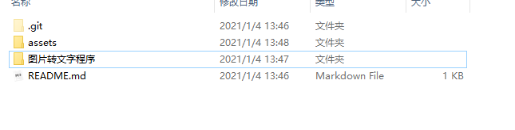
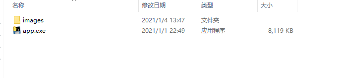
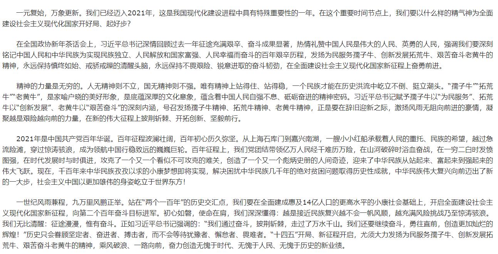
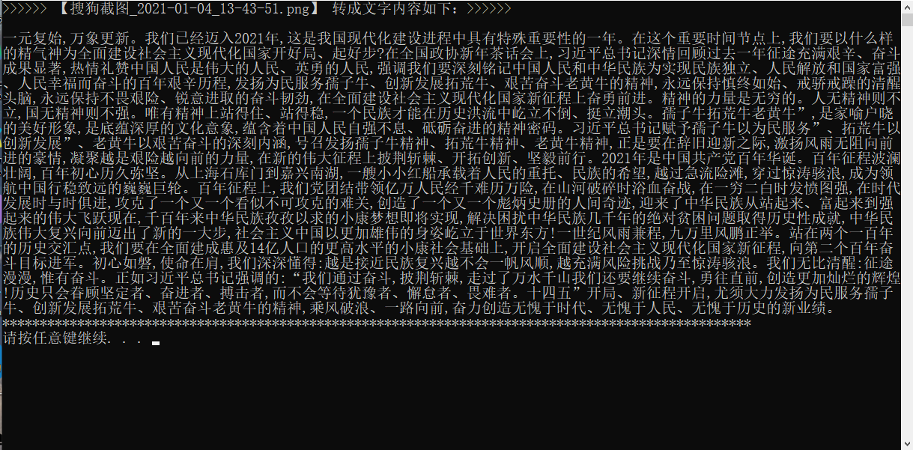

# 图片转文字的程序
> 介绍：采用python图片转文字的程序，然后利用pyinstall打包成exe可执行文件，双击即可使用！


## 使用

```sh
## 1. 下载
git clone https://github.com/AdleyTales/img2text.git

# or 直接下载zip包

## 2.进入到 `图片转文字程序` 目录下, 把要转化的图片，截图拷贝到images目录下，然后直接双击`app.exe`即可！

```



---



#### 示例

- 原图片：


- 转化后的文字：



